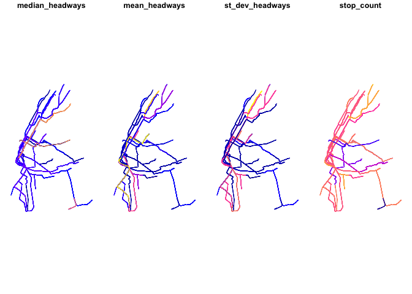

[](https://travis-ci.com/r-transit/tidytransit)
[](https://cran.r-project.org/package=tidytransit)

# tidytransit

tidytransit makes it easy to work with transit data by simplifying [General Transit Feed Specification](http://gtfs.org/) data (the standard format for storing transit data) into tidyverse and sf-friendly dataframes. Use it to map existing stops and routes, calculate transit frequencies, and validate transit feeds.

tidytransit is a [fork](https://en.wikipedia.org/wiki/Fork_(software_development)) of [gtfsr](https://github.com/ropensci/gtfsr), published to [CRAN](https://cran.r-project.org/), with frequency calculation functions, and without GTFS-specific interactive cartography features. 

## Installation

This package requires a working installation of [sf](https://github.com/r-spatial/sf#installing). 

``` r
# Once sf is installed, you can install from CRAN with: 
install.packages('tidytransit')

# For the development version from Github:
# install.packages("devtools")
devtools::install_github("r-transit/tidytransit")
```

For some users, `sf` is impractical to install due to system level dependencies. For these users, [`trread`](https://github.com/r-transit/trread) may work better. It has more limited functionality, but it can read GTFS tables into R. 

## Usage

### Get Headways by Route

This example uses NYC MTA subway schedule data to identify shortest median headways by route, pulling data directly from the MTA's GTFS URL.

``` r
library(tidytransit)
library(dplyr)

# Read in GTFS feed
nyc <- import_gtfs("http://web.mta.info/developers/data/nyct/subway/google_transit.zip")

# Get route frequencies
nyc_route_freqs <- nyc %>% 
  get_route_frequency()

# Find routes with shortest median headways
nyc_fastest_routes <- nyc_route_freqs %>% 
  filter(median_headways < 25) %>% 
  arrange(median_headways)

knitr::kable(head(fast_routes))
```

| route\_id | median\_headways | mean\_headways | st\_dev\_headways | stop\_count |
| :-------- | ---------------: | -------------: | ----------------: | ----------: |
| GS        |                4 |              4 |              0.01 |           4 |
| L         |                4 |              4 |              0.13 |          48 |
| 1         |                5 |              5 |              0.14 |          76 |
| 7         |                5 |              5 |              0.29 |          44 |
| 6         |                6 |              7 |              2.84 |          76 |
| E         |                6 |             23 |             53.01 |          48 |


### Get Headways by Stop

You can also identify shortest headways by stop.

``` r
nyc_stop_freqs <- nyc %>% 
  get_stop_frequency(by_route = FALSE) %>%
  inner_join(nyc$stops_df, by = "stop_id") %>%
  select(stop_name, direction_id, stop_id, headway) %>%
  arrange(headway)

head(nyc_stop_freqs)
```

    ## # A tibble: 6 x 4
    ## # Groups:   direction_id, stop_id [6]
    ##   direction_id stop_id stop_name             headway
    ##          <int> <chr>   <chr>                   <dbl>
    ## 1            0 902N    Times Sq - 42 St         3.60
    ## 2            1 901S    Grand Central - 42 St    3.60
    ## 3            1 902S    Times Sq - 42 St         3.60
    ## 4            0 901N    Grand Central - 42 St    3.61
    ## 5            0 702N    Mets - Willets Point     3.72
    ## 6            0 707N    Junction Blvd            3.72


### Map Route Frequencies

Perhaps you want to map subway routes and color-code each route by how often trains come. First, turn the routes and stops tables in [`simple features`](https://github.com/r-spatial/sf) data frames:

``` r
nyc <- gtfs_as_sf(nyc)
```

This adds routes and stops tables with simple features/geometries to the list of NYC GTFS data. You can then join frequencies to route geometries and plot them with base R.

``` r
routes_sf <- nyc$sf_routes %>% 
  right_join(nyc_fastest_routes, by = "route_id") %>% 
  select(-route_id)

plot(routes_sf)
```

<!-- -->

## Additional Information

### GTFS Table Relationships

If you're curious about learning more about GTFS data, [Danny Whalen](https://github.com/invisiblefunnel) made a nice graph of
the relationships among gtfs tables in the
[partridge](https://github.com/remix/partridge) package for Python,
copied below. This can be a very helpful guide as you try to get a grasp
on the kinds of questions you might want to ask of transit schedule
data.


### Background

In function, this package and the tools it imports take their inspiration, and some code, from the [ROpenSci gtfsr](https://github.com/ropensci/gtfsr) package.
